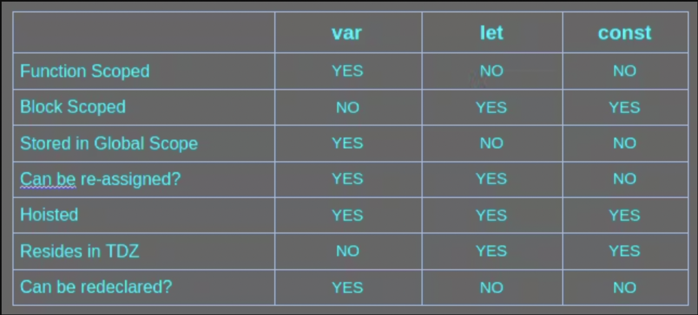

Traditionally, the keyword `var` is been used to declare variables in JavaScript but ES6 introduced two other keywords `let` and const to declare a variable. There are some issues with `var` that `let` and `const` try to solve.

Let's look into details about `let` and `const` and compare them with `var`.

### a. `let` and `const` are block { } scoped.

This means `let` and `const` declared in a block can not be accessed outside of that block, whereas `var` is function scoped, meaning var variables can not be accessed outside of the function in which it is declared.

See code snippet below for more clarity.

```javascript
// Scenario - 1
{
  const y = 20;
  var z = 30;
  console.log(y) // 20
  console.log(z) // 30
}
console.log(z); // 30
console.log(y); // Uncaught ReferenceError: y is not defined

// scenario -2
function foo(){
  var a = 2;
  console.log(a); // 2
}
foo(); 
console.log(a) //Uncaught ReferenceError: a is not defined"

```
### b. `let` and `const` can not be redclared in the same scope.

We can not redeclare `let` and `const` variables in the same scope but var has no such restrictions. Redeclaring var will overwrite the older variable's value.

```jsx
// Var scenario
var x = 10;
console.log(x); // 10

var x = "Twitter";
console.log(x) // Twitter

// Let or const scenario
let y = 20;
let y = "Twitter"; // This line gives Error
```
> *NOTE* that the above program will not print anything unless you remove the erroneous last line.

### c. `let` and `const` can not be accessed before declaration.

`let` and `const` reside at a special memory location called the temporal dead zone (TDZ). TDZ ends when the execution reaches the line where they are declared. So, after that line, if `let` variable is not initialized with a value, it logs undefined.

```javascript
console.log(a); // Undefined
var a = 10;

let c;
console.log(c); // undefined

console.log(b); // Error
let b = 20;
```
> I have summarized all features of let and const in one image. See the below image.

