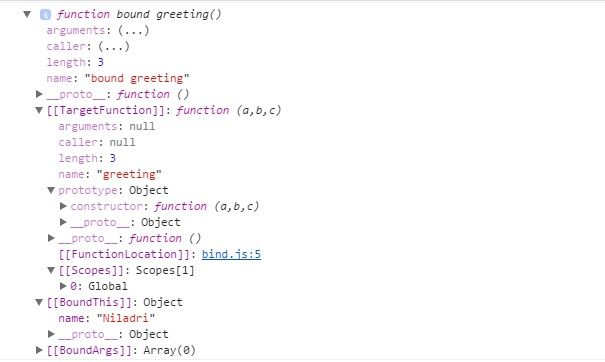

we will be discussing the difference between `call()`, `apply()`, and `bind()` methods of JavaScript functions with simple examples. As functions are also Objects in JavaScript, these 3 methods are used to control the invocation of the function. `call()` and `apply()` were introduced in ECMAScript 3 while `bind()` was added as part of ECMAScript 5.

### Uses
You can use `call()/apply()` to invoke the function immediately.` bind()` returns a bound function that, when executed later, will have the correct context **("this")** for calling the original function. So `bind()` can be used when the function needs to be called later in certain events when it's useful.

### call() or Function.prototype.call()

Check the code sample below for `call()`

```javascript
//Demo with javascript .call()

var obj = {name:"Niladri"};

var greeting = function(a,b,c){
    return "welcome "+this.name+" to "+a+" "+b+" in "+c;
};

console.log(greeting.call(obj,"Newtown","KOLKATA","WB"));
// returns output as welcome Niladri to Newtown KOLKATA in WB
```

The first parameter in `call()` method sets the **"this"** value, which is the object, on which the function is invoked upon. In this case, it's the **"obj"** object above.

The rest of the parameters are the arguments to the actual function.

### apply() or Function.prototype.apply()

Check the below code sample for `apply()`

```javascript
//Demo with javascript .apply()

var obj = {name:"Niladri"};

var greeting = function(a,b,c){
    return "welcome "+this.name+" to "+a+" "+b+" in "+c;
};

// array of arguments to the actual function
var args = ["Newtown","KOLKATA","WB"];  
console.log("Output using .apply() below ")
console.log(greeting.apply(obj,args));

/* The output will be 
  Output using .apply() below
 welcome Niladri to Newtown KOLKATA in WB */
 ```

 Similarly to` call()` method the first parameter in `apply()` method sets the **"this"** value which is the object upon which the function is invoked. In this case it's the **"obj"** object above. The only difference of `apply()` with the `call()` method is that the second parameter of the `apply()` method accepts the arguments to the actual function as an array.

 ### bind() or Function.prototype.bind()

 Check the below code sample for **bind()**

 ```javascript
 //Use .bind() javascript

var obj = {name:"Niladri"};

var greeting = function(a,b,c){
    return "welcome "+this.name+" to "+a+" "+b+" in "+c;
};

//creates a bound function that has same body and parameters 
var bound = greeting.bind(obj); 


console.dir(bound); ///returns a function

console.log("Output using .bind() below ");

console.log(bound("Newtown","KOLKATA","WB")); //call the bound function

/* the output will be 
Output using .bind() below
welcome Niladri to Newtown KOLKATA in WB */
```
In the above code sample for `bind()` we are returning a bound function with the context which will be invoked later. We can see the bound function in the console as below .



The first parameter to the bind() method sets the value of "this" in the target function when the bound function is called. Please note that the value for first parameter is ignored if the bound function is constructed using the "new" operator.
The rest of the parameters following the first parameter in bind() method are passed as arguments which are prepended to the arguments provided to the bound function when invoking the target function.

That's all for now. Thank you for reading and I hope this post will be helpful for beginners who are facing issues regarding the `apply()`, `call()`, and `bind()` methods of JavaScript.